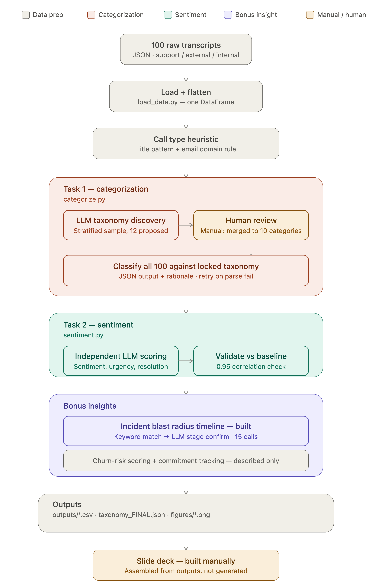
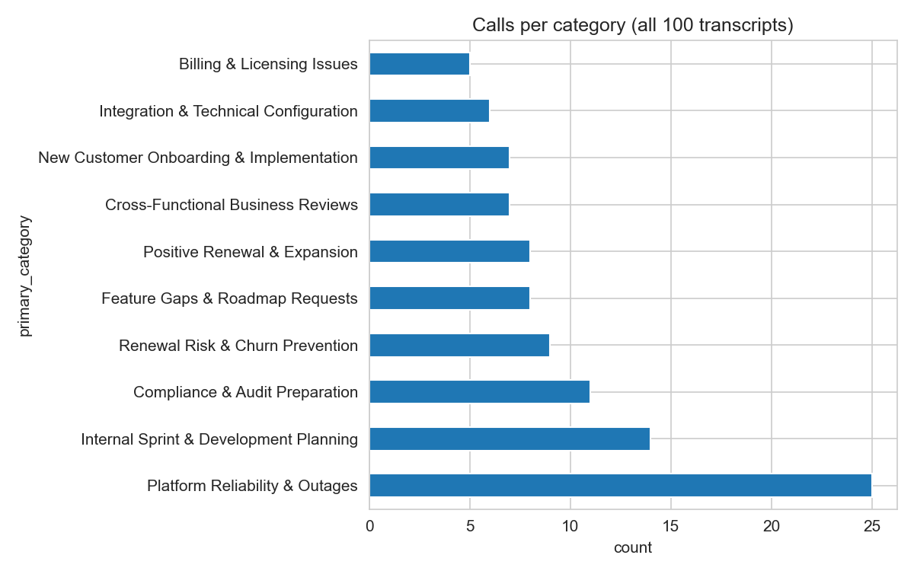
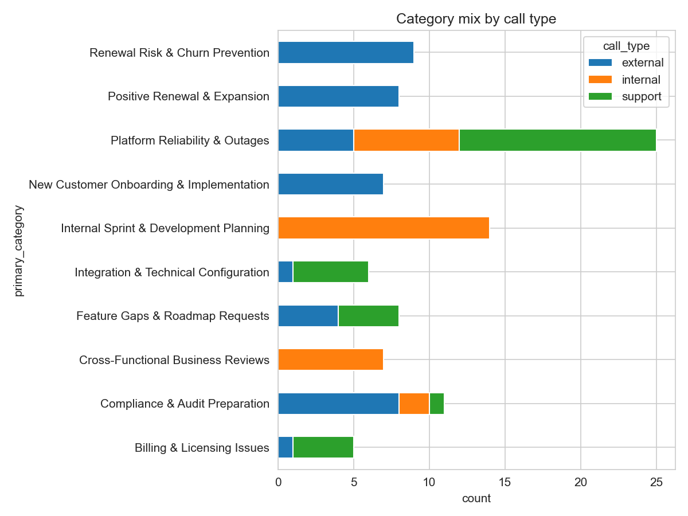
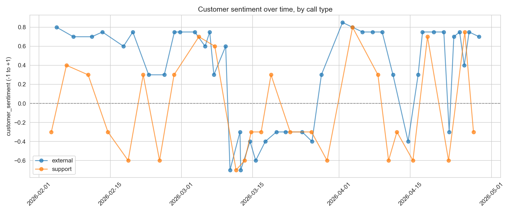
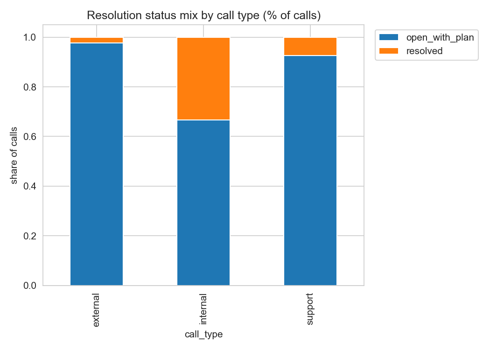
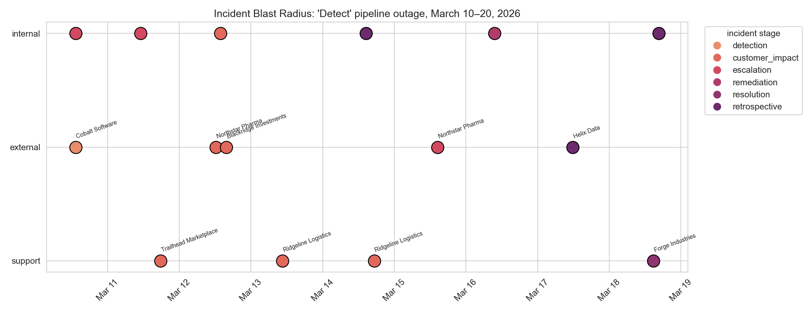

# Transcript Intelligence

> AI-powered enterprise transcript analytics pipeline that categorizes conversations, analyzes sentiment, and extracts cross-functional business insights using Large Language Models.

Built as a take-home assignment demonstrating LLM orchestration, structured outputs, hybrid human-in-the-loop categorization, and product-focused insight generation.

---

## 🚀 Highlights

- Hybrid **LLM + Human-Reviewed Taxonomy** topic classification
- Multi-dimensional sentiment analysis beyond simple positive/negative labels
- Cross-functional incident timeline reconstruction
- Validation against the dataset's pre-existing baseline fields, not blind reuse
- Modular, reproducible pipeline with clean project structure

---

# Business Problem

Enterprise organizations generate large volumes of call transcripts every month across Customer Support, Sales/Account Management, and Engineering/Product teams.

While these conversations contain valuable business intelligence, manually reviewing them is:

- Time-consuming
- Expensive
- Difficult to scale
- Inconsistent across reviewers

This project demonstrates how an AI-powered pipeline can turn unstructured call transcripts into categorized, sentiment-scored, and cross-functionally connected insights for business leaders.

---

# Architecture

<p>

</p>

The pipeline follows a modular architecture:

```
Raw Transcripts
        │
        ▼
Load & Flatten Transcripts
        │
        ▼
Call Type Detection (heuristic)
        │
        ▼
Hybrid Topic Categorization (LLM discovery → human review → classify)
        │
        ▼
Sentiment Analysis (independent scoring + baseline validation)
        │
        ▼
Bonus Insight: Incident Blast Radius Timeline
        │
        ▼
Outputs (CSVs, JSON, figures)
        │
        ▼
Slide Deck (built manually from outputs)
```

---

# Repository Structure

```
.
├── assets/
│   └── architecture.png
│
├── data/
│   └── raw_transcripts/
│
├── notebooks/
│   ├── 00_data_exploration.ipynb
│   ├── 01_categorization.ipynb
│   ├── 02_sentiment.ipynb
│   └── 03_bonus_insights.ipynb
│
├── outputs/
│   ├── figures/
│   ├── categorization_results.csv
│   ├── sentiment_results.csv
│   ├── incident_blast_radius_timeline.csv
│   └── taxonomy_FINAL.json
│
├── src/
│   ├── load_data.py
│   ├── llm_client.py
│   ├── categorize.py
│   ├── sentiment.py
│   └── outage_blast_radius.py
│
├── requirements.txt
├── .env.example
└── README.md
```

---

# Dataset

The project uses approximately **100 B2B SaaS call transcripts** provided as part of the interview assignment, for a fictional cybersecurity/compliance company, "Aegis Cloud."

The dataset contains conversations across:

- Customer Support
- External Customer Calls (sales, renewals, account management)
- Internal Engineering & Product Meetings

The original dataset is preserved unchanged under:

```
data/raw_transcripts/
```

---

# Installation

Clone the repository

```bash
git clone <repository-url>

cd transcript-intelligence
```

Install dependencies

```bash
pip install -r requirements.txt
```

Configure environment variables

```bash
cp .env.example .env
```

Add your OpenRouter API key

```
OPENROUTER_API_KEY=YOUR_API_KEY
```

---

# Running the Project

## Topic Discovery

Generate an initial taxonomy using a representative transcript sample.

```bash
python src/categorize.py
```

---

## Review Taxonomy

Review

```
outputs/discovered_taxonomy_RAW.json
```

Finalize it as

```
outputs/taxonomy_FINAL.json
```

This is a deliberate manual checkpoint — the locked taxonomy used for classification was reviewed by hand and reduced from 12 LLM-proposed categories to 10, merging two that were thin or overlapping. See the `description` field of each category in `taxonomy_FINAL.json` for the reasoning behind each merge.

---

## Classify All Transcripts

```bash
python src/categorize.py --classify
```

Outputs

- Category
- Confidence
- Structured reasoning
- Supporting evidence

---

## Run Sentiment Analysis

```bash
python src/sentiment.py
```

Outputs

- Customer sentiment
- Urgency
- Resolution status
- Sentiment trajectory

---

## Generate Cross-functional Incident Timeline

```bash
python src/outage_blast_radius.py
```

---

# Methodology

## 1. Call Type Detection

Since call types were not explicitly available in the raw dataset, they were derived using a transparent two-rule heuristic:

- Title contains "Support Case" → support
- All participant emails share the company domain → internal
- Otherwise (company + at least one external domain) → external

Final distribution:

| Call Type | Count |
|-----------|------:|
| External | 43 |
| Internal | 30 |
| Support | 27 |

---

## 2. Hybrid Topic Categorization

A hybrid approach was chosen to balance flexibility and consistency.

### Phase 1

An LLM discovers candidate business topics from a stratified sample, bottom-up rather than from a predefined list.

### Phase 2

The taxonomy is manually reviewed to merge overlapping or thin categories (12 proposed → 10 locked) and improve consistency.

### Phase 3

Every transcript is classified against the locked taxonomy using structured JSON outputs, with one retry before falling back to an UNCLASSIFIED label.

This approach avoids inconsistent labels while preserving the flexibility of LLM-based discovery.

---

## 3. Multi-dimensional Sentiment Analysis

Rather than relying on the dataset's pre-existing sentiment field, sentiment is independently re-derived across four dimensions: customer sentiment, urgency, resolution status, and conversation trajectory.

The resulting scores are compared against the dataset's baseline `sentimentScore` as a validation check (0.95 correlation). That correlation is treated as a useful sanity check rather than proof the independent scoring is more rigorous — it likely also reflects how explicit the emotional/business signal is in this dataset's dialogue. The real value of the independent pipeline is the richer dimensions (urgency, resolution status, trajectory) that the baseline field didn't capture at all.

---

## 4. Cross-functional Incident Analysis

The pipeline reconstructs one real product incident (a pipeline outage) by connecting conversations across all three call types — internal engineering response, external customer escalations, and support tickets — that today live in three separate team silos.

Candidate calls are found via a transparent keyword match on call titles, then confirmed (and false positives filtered out) by an LLM stage-extraction step that also identifies the affected customer and incident lifecycle stage. This demonstrates organization-wide visibility into the cost of a single incident that no single team's view of the data would show.

---

# Engineering Decisions

| Problem | Decision | Why |
|----------|----------|-----|
| Topic Classification | Hybrid LLM + Locked Taxonomy | Flexible discovery, reproducible classification |
| Sentiment | Independent re-scoring | Richer dimensions than baseline; baseline used as a sanity check, not ground truth |
| Pipeline | Modular Python scripts | Maintainability & testing |
| Outputs | CSV + JSON + Figures | Easy inspection |
| Analysis | Jupyter notebooks | Reproducible experimentation |

---

# Key Findings

## Platform Reliability Impacts Every Team

Platform Reliability & Outages was the only category that showed up meaningfully across all three call types (25 of 100 calls), while every other category lived almost entirely within one call type — reliability problems are the one thing that ripples through the whole organization.

---

## Resolution Rates Differ Significantly

| Call Type | Resolved During Call |
|-----------|--------------------:|
| Internal | 33% |
| Support | 7.4% |
| External | 2.3% |

Conversation volume alone is therefore not a reliable indicator of whether issues are actually getting closed out.

---

## Most Conversations Improve

Conversation trajectory:

- Improving → 67%
- Stable → 31%
- Deteriorating → 2%

The only two deteriorating conversations were both internal, technical-team calls discovering the scale of an active production outage in real time — not customer-facing calls, which are structurally built to land somewhere better by the end even when the underlying issue isn't resolved.

---

# Visualizations

## Category Distribution



---

## Categories by Call Type



---

## Sentiment Trends



---

## Resolution Status



---

## Incident Blast Radius Timeline



---

# Bonus Insights — One Built, Two Described

This project deliberately builds one bonus insight fully rather than three partially, on the assignment's own guidance that a well-reasoned unbuilt idea is worth more than a rushed one.

**Built: Incident Blast Radius Timeline.** Traces one real outage across internal, external, and support calls and 7 affected customer accounts — see above.

**Described, not built: Churn-risk scoring.** Would combine sentiment trajectory across an account's full call history, support ticket frequency, and explicit risk language into a continuously-updated risk score for account/customer success teams. Not built because most accounts in this dataset only appear in 1-4 calls each — too thin to validate a per-account trend reliably.

**Described, not built: Commitment / action-item follow-through tracking.** Would track whether commitments logged in the dataset's `actionItems` field are actually referenced as resolved in a later call. Not built because reliably matching a commitment across two separate calls is a harder linking problem than the other two insights, and would need a larger validated sample to trust precision/recall.

Full reasoning for both in `notebooks/03_bonus_insights.ipynb`.

---

# A Bug Worth Mentioning

During the categorization run, one call failed with a JSON parsing error ("Extra data") caused by the model occasionally appending content after a complete JSON object. Fixed in `src/llm_client.py` by scanning for the first balanced `{...}` block instead of naively parsing the full response, plus a retry before falling back to an UNCLASSIFIED label. Left in this writeup as a real example of debugging a pipeline failure, not just the clean final run.

---

# Limitations

- Taxonomy still benefits from periodic human review as new call types or themes emerge.
- LLM inference introduces latency and API cost, and output is non-deterministic run to run.
- Call type detection depends on title/domain conventions holding — would need adjustment for a real, messier dataset.
- The incident-detection step uses a hand-identified keyword match for this one incident; generalizing it to auto-detect arbitrary cross-functional incidents would need temporal/semantic clustering instead (described in `src/outage_blast_radius.py`, not built).
- Churn-risk scoring and commitment-tracking insights are described but not implemented (see above).

---

# Possible Next Steps

- Generalize incident detection: embed call summaries, cluster temporally-close and semantically-similar calls, auto-flag any cluster spanning 2+ call types as a candidate incident, rather than relying on a hand-picked keyword match.
- Build out churn-risk scoring once more per-account call history is available.
- Build out commitment/action-item follow-through tracking with a validated sample.
- Make taxonomy review a recurring step rather than a one-time lock, as new call themes appear over time.

---

# Technologies Used

### Languages

- Python

### AI

- Claude Sonnet 4.5 (via OpenRouter)
- Structured JSON Outputs

### Data

- Pandas

### Visualization

- Matplotlib, Seaborn

### Development

- Jupyter Notebook
- python-dotenv

---

# Deliverables

This repository contains:

- The processing pipeline (src/)
- Jupyter notebooks with reasoning and validation (notebooks/)
- Generated outputs (outputs/)
- Business insights and findings (this README, and the accompanying slide deck)

---

# Acknowledgements

This project is intended solely for evaluation and portfolio purposes.